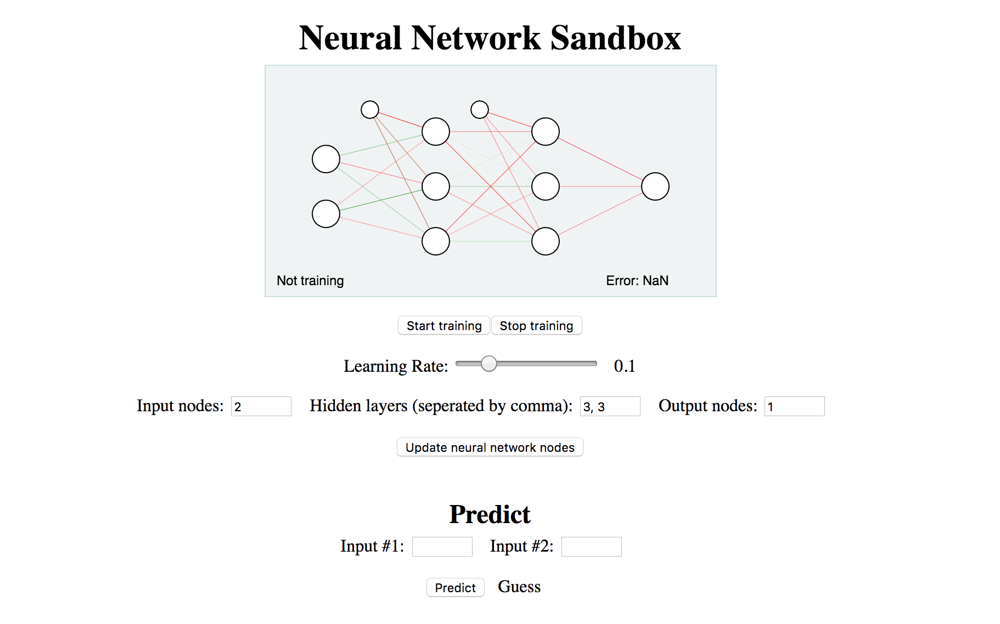
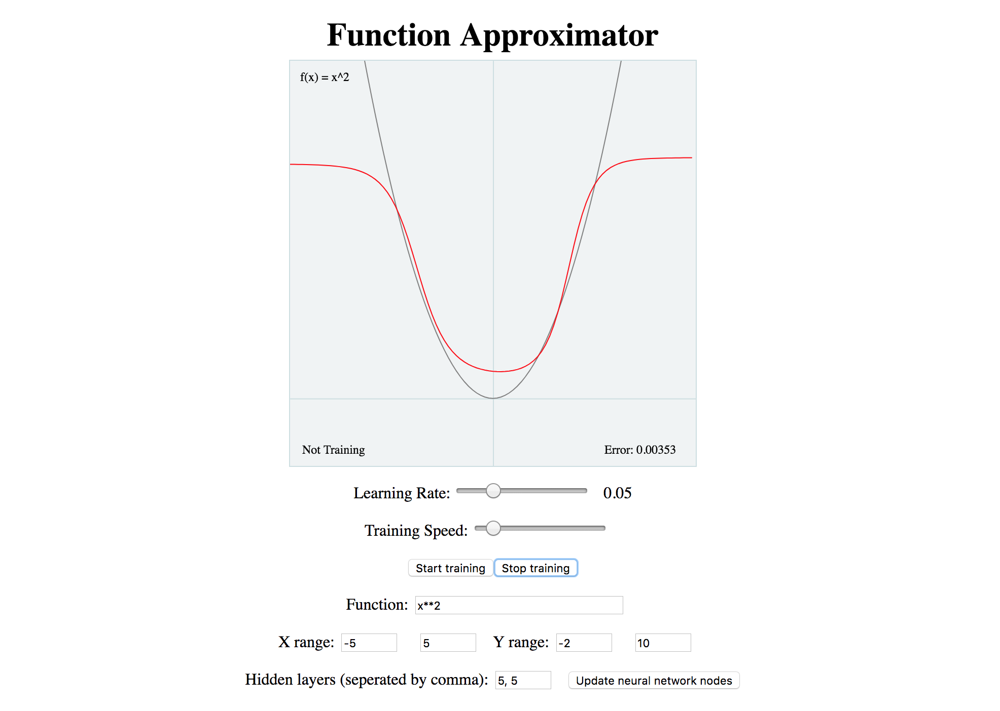
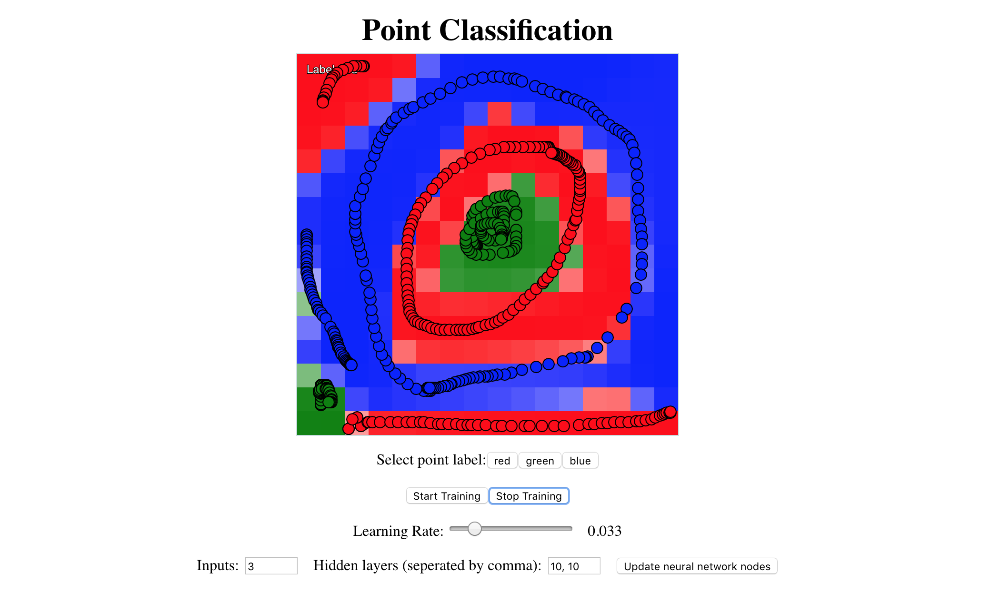

# Neuron

> An educational neural network library with a bunch of examples

_This library is based on [Coding Train's video series on neural networks](https://www.youtube.com/playlist?list=PLRqwX-V7Uu6Y7MdSCaIfsxc561QI0U0Tb), and the [Toy Neural Network](https://github.com/CodingTrain/Toy-Neural-Network-JS)_

## Examples

See a list of all the examples [here](https://viktorstrate.github.io/neuron/examples/)

### Sandbox

Construct a neural network, and add custom training data [link](https://viktorstrate.github.io/neuron/examples/sandbox/index.html)

### Function approximator

Use a neural network to approximate a function [link](https://viktorstrate.github.io/neuron/examples/function-approximator/index.html)

### Point classification

Classify color labels on a 2D coordinate space [link](https://viktorstrate.github.io/neuron/examples/point-classification/index.html)

